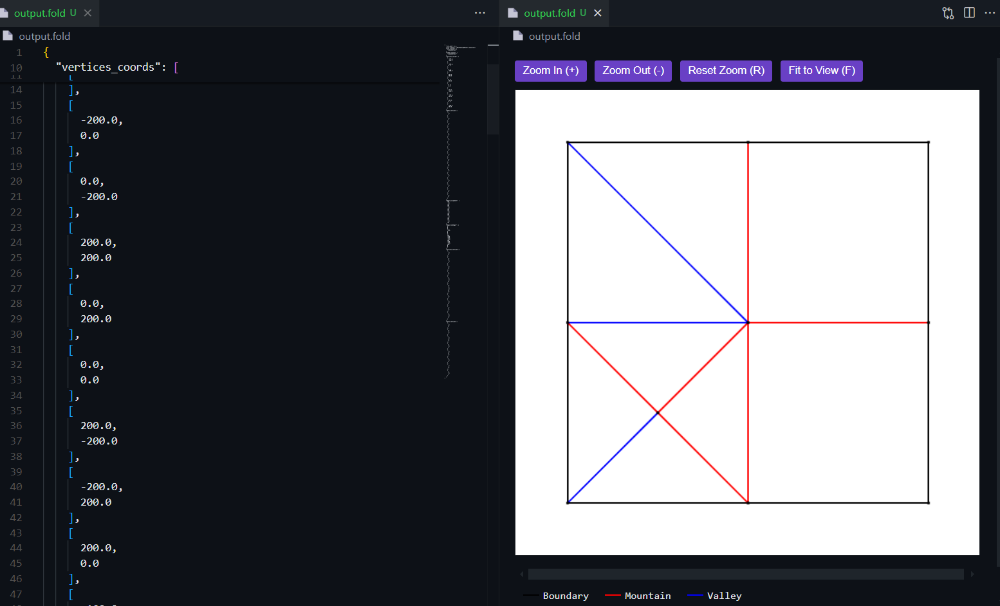

# Origami FOLD File Visualizer and Format

Preview and editor support for FOLD (Flexible Origami List Datastructure) files.

## Features

### 🔍 Interactive Preview
- Pan and zoom controls
- Customizable fold styles and colors
- Live updates as you edit
- Legend showing fold types and labels
- Optional index labels for vertices, edges, and faces

### ✨ Editor Features
- Syntax highlighting
- JSON formatting
- Format on save support
- Custom file icons
- Bracket matching

## Quick Start

1. Open a .fold file
2. Click the preview icon in the editor title bar (or use `Ctrl+K V` / `Cmd+K V`)
3. Edit your file and watch the preview update

### Preview Controls
- 🖱️ **Zoom**: Mouse wheel or `+`/`-` keys
- 🖐️ **Pan**: Click and drag
- 🔄 **Reset**: `R` key or "Reset Zoom" button
- 📐 **Fit**: `F` key or "Fit to View" button
- 🏷️ **Labels**: Toggle vertex, edge, and face labels

### Formatting
- Format Document: `Shift+Alt+F`
- Right-click → Format Document
- Format on save (optional)

## Customization

### Visual Settings
Customize through VS Code's Settings UI:
- Colors for each fold type
- Line styles
- Vertex appearance
- Canvas properties
- Label styles

### Default Settings
- Mountain folds: Red, dash-dot
- Valley folds: Blue, dashed
- Boundary edges: Black, solid
- Vertices: Visible, black
- Background: White
- Labels: Color-coded circles with indices

### Configuration
All settings available in settings.json or through Settings UI (Extensions > FOLD Preview).

## Requirements

Visual Studio Code version 1.80.0 or higher

## Support

Found a bug or have a suggestion? Please report it on the [GitHub repository](https://github.com/Googolplexic/vscode-fold-preview/issues).

**Enjoy!**