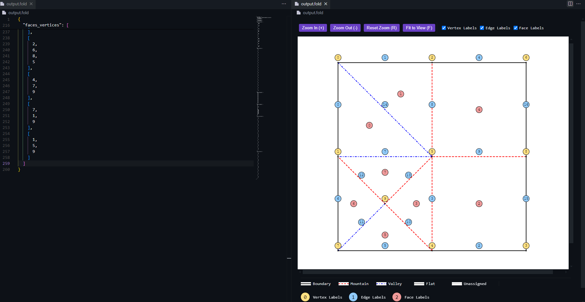

# Origami FOLD File Visualizer and Format

Interactive preview and editor support for FOLD (Flexible Origami List Datastructure) files. View, edit, and format your .fold files with ease.

## Features

### 🔍 Interactive Preview
Watch your FOLD files come to life with a real-time, interactive preview:
- Pan and zoom controls with full-window canvas
- Customizable fold styles and colors
- Live updates as you edit
- Keyboard shortcuts for quick navigation
- Interactive legend
- Vertex, edge, and face labeling system



### ✨ Editor Enhancements
Work efficiently with powerful editor features:
- Syntax highlighting
- Customizable JSON formatting
- Format on save support
- Custom file icons
- Smart bracket matching

## Quick Start

1. Open a .fold file
2. Click the preview icon in the editor title bar (or use `Ctrl+K V` / `Cmd+K V`)
3. Edit your file and watch the preview update in real-time

### Preview Controls
- 🖱️ **Zoom**: Mouse wheel or `+`/`-` keys
- 🖐️ **Pan**: Click and drag
- 🔄 **Reset**: `R` key or "Reset Zoom" button
- 📐 **Fit**: `F` key or "Fit to View" button
- 🏷️ **Labels**: Toggle labels for vertices, edges, and faces

### Formatting
Keep your FOLD files clean and consistent:
- Format Document: `Shift+Alt+F`
- Right-click → Format Document
- Automatic formatting on save (optional)

## Customization

### 🎨 Visual Settings
Easily customize through VS Code's Settings UI:
- Colors for each fold type
- Line styles (solid, dashed, dotted, dash-dot)
- Vertex appearance
- Canvas background and padding
- Zoom speed and behavior
- Label styles and colors

### 📝 Default Styles
Out of the box, you'll get:
- Mountain folds: Red, dash-dot style
- Valley folds: Blue, dashed style
- Boundary edges: Black, solid style
- Visible vertices
- White background
- Labels:
  - Vertices: Light yellow circles
  - Edges: Light blue circles
  - Faces: Light red circles

### ⚙️ Advanced Configuration
Fine-tune everything in settings.json:
```json
{
    "fold-preview.colors.mountain": "#FF0000",
    "fold-preview.lineStyles.mountainStyle": "dashed-dotted",
    "fold-preview.vertices.show": true,
    "fold-preview.canvas.backgroundColor": "#FFFFFF",
    "fold-preview.labels.vertex.background": "#FFE082",
    "fold-preview.labels.edge.background": "#90CAF9",
    "fold-preview.labels.face.background": "#EF9A9A",
    "fold-preview.labels.fontSize": 12,
    "fold-preview.labels.offset": 16
}
```
Access all settings through VS Code's Settings UI under Extensions > FOLD Preview.

## Requirements

Visual Studio Code version 1.80.0 or higher

## Credits

- FOLD file specification: https://github.com/edemaine/fold
- Claude AI by Anthropic
- VSCode extension documentation

## Support

Found a bug or have a suggestion? Please report it on my [GitHub repository](https://github.com/Googolplexic/vscode-fold-preview/issues).

**Enjoy working with FOLD files!**
